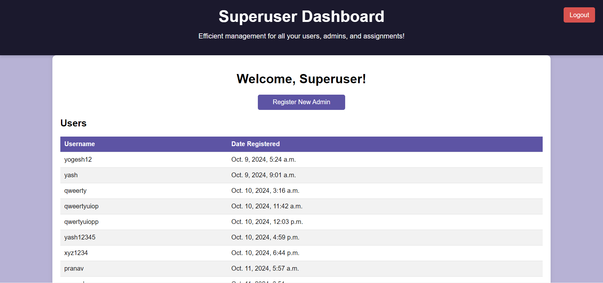

## Assignment Portal

Overview

The Assignment Portal is a web application built using Django and MongoDB that allows users to manage assignments. The application features three distinct roles: User, Admin, and Superuser. Each role has specific permissions and functionalities, ensuring a structured workflow for managing assignments.

## Roles

### User
- Users can register and log in to the application.
- Users can submit assignments and view the assignments they have submitted previously, along with their status (whether accepted or rejected).

### Admin
- Admins can only be registered by the Superuser.
- Admins can view all assignments tagged to them and have the ability to accept or reject these assignments.

### Superuser
- There is only one Superuser in the system, with the following credentials:
  - **Username:** xyz
  - **Password:** xyz1234
- The Superuser can register new Admins and view all registered Users and Admins.
- The Superuser can also see all assignments submitted by each User to their respective Admin.

All roles can log in through the same login page. Simply enter your credentials to access the appropriate dashboard based on your role.


## Screenshots

### Homepage


*These screenshots showcase the homepage of the application, featuring an intuitive layout and navigation options for users to access various functionalities.*

### Login Page

*This is the login page where users can enter their credentials (username and password) to access their respective dashboards. The design is user-friendly, ensuring ease of use for all roles.*

### Register Page

*The registration page where new users can create their accounts.*

### User Dashboard

*This is the user dashboard, which displays the assignments submitted by the user along with their statuses.*

### Upload Assignment

*This screenshot depicts the upload assignment page where users can submit their assignments. It provides fields for entering details related to the assignment as needed.*

### Admin Dashboard

*The admin dashboard allows admins to view and manage assignments assigned to them. Admins can accept or reject assignments and monitor the status of submissions from users.*

### Superuser Dashboard


*These screenshots illustrate the superuser dashboard, providing an overview of all registered users and admins, along with details on assignments submitted by users. The superuser has the ability to manage and oversee the activities of other roles.*

### Register Admin

*This screenshot shows the page where the superuser can register new admin accounts. It includes fields for entering the admin's username and password, ensuring that only authorized personnel can create admin accounts.*

## Technology Stack

- **Python**: Version 3.8
- **Django**: A high-level Python web framework for building web applications.
- **Djongo**: A connector for integrating Django with MongoDB, allowing for seamless data management.
- **MongoDB**: A NoSQL database used for storing application data.

## Setup Instructions

```markdown
# Setup Instructions

## 1. Clone the Repository

```bash
git clone <repository-url>
cd assignment_portal
```

## 2. Create a Virtual Environment

Make sure to install `virtualenv` if you haven't already:

```bash
pip install virtualenv
```

Create a virtual environment:

```bash
virtualenv venv
```

## 3. Activate the Virtual Environment

### Windows

```bash
venv\Scripts\activate
```

### macOS and Linux

```bash
source venv/bin/activate
```

## 4. Install Dependencies

```bash
pip install -r requirements.txt
```

## 5. Set up your MongoDB Database

If you are using a local MongoDB instance, ensure it's running. You can install and start MongoDB by following the [MongoDB installation guide](https://docs.mongodb.com/manual/installation/).

You need to configure your MongoDB details in `settings.py`. Modify the `DATABASES` section like this:

```python
DATABASES = {
    'default': {
        'ENGINE': 'djongo',
        'NAME': 'your_database_name',
        'CLIENT': {
            'host': 'localhost',
            'port': 27017,
            'username': 'your_mongodb_username',   # Optional if no auth is set
            'password': 'your_mongodb_password',   # Optional if no auth is set
            'authSource': 'admin'
        }
    }
}
```

## 6. Run Migrations (if applicable)

If your application requires database migrations, run:

```bash
python manage.py migrate
```

## 7. Run the Development Server

```bash
python manage.py runserver
```
```

You can copy and paste this formatted text directly into your `README.md` file. Let me know if you need any further adjustments!

